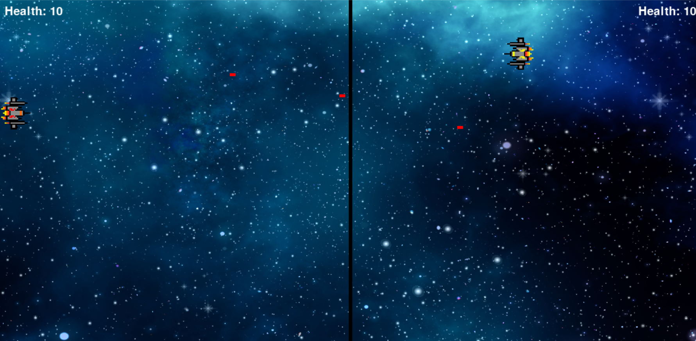

# Space Wars Game

## Screenshots

## Inspiration
I was introduced to Pygame library by a friend and after creating the infamous snake game, I decided to create something myself and came up with this game. It's my first attempt and a lot more features can be added.
## How To Play
 - Run SpaceWars.py
 - To move red spaceship, use "W A S D" key and "Left Alt" key to fire.
 - To move yellow spaceship, use "Left Right Up Down" arrow keys and "Right Alt" key to fire.
 
## End
